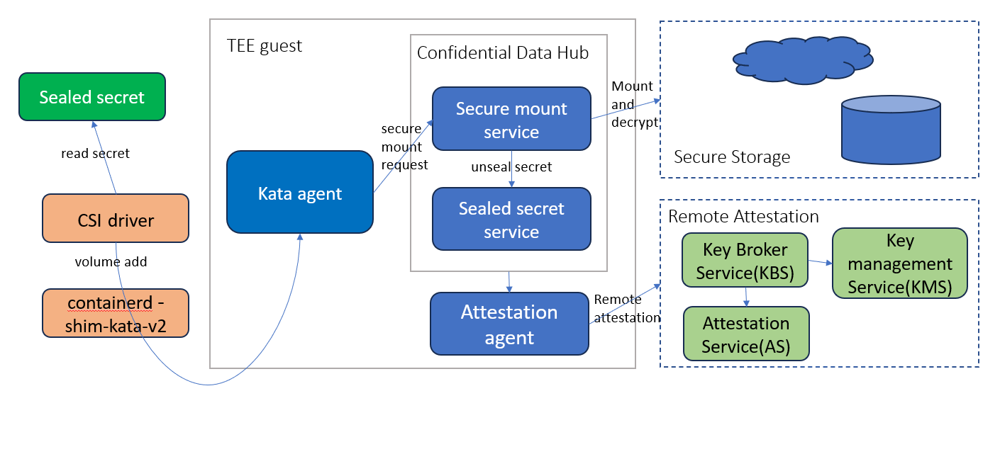
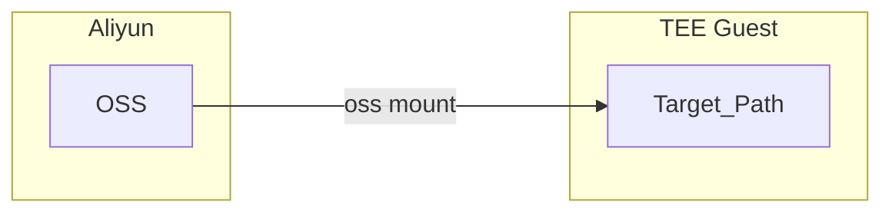
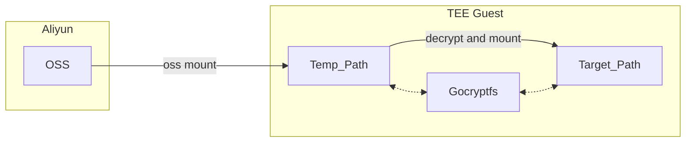

# Secure Storage

## Purpose
The Purpose of this secure storage feature is:
1. Mounting external storage from guest instead of host which would then share it to guest, this is due to performance consideration.
2. The unencrypted data in storage could only be accessed within TEE, that is why we call it secure storage.

## Architecture

First of all, the sensitive information of external storage is sealed by the key from KBS/KMS, and store in [sealed secret](https://github.com/confidential-containers/guest-components/blob/main/confidential-data-hub/docs/SEALED_SECRET.md). The sensitive information includes access key id/access key secret to storage, the encryption key of the data(such as AI model) stored in the storage, which also means we supported client encryption.
We reuse [direct block device assigned volume feature](https://github.com/kata-containers/kata-containers/blob/main/docs/design/direct-blk-device-assignment.md) to mount external storage from guest directly. CSI plugin, such as [alibaba cloud OSS CSI plugin](https://github.com/kubernetes-sigs/alibaba-cloud-csi-driver/blob/master/docs/oss.md) reads the sensitve information from sealed secret and pass it to kata agent. When secure mount service in CDH receives secure mount request, it calls sealed secret service to unseal the sensitive information mentioned above, this process could be based on remote attestation. If success, the secure mount service would use the unsealed sensitive information to mount the external storage and decrypt the data in storage.

## Plugins

### Aliyun OSS

[Aliyun OSS](https://www.alibabacloud.com/product/object-storage-service) is an object storage service provided by Alibaba Cloud (Aliyun).

The [plugin](../storage/src/volume_type/aliyun) provides two different modes for secure mount.

Confidential Data Hub's `secure_mount()` [API](../hub/protos/api.proto) will help to instrument this.

#### Plaintext data in OSS

In this mode, the mounted file directory tree are stored inside OSS as plaintext. This hints that the user SHOULD trust the OSS as OSS service could see the plaintext of the data.
The architecture diagram is

#### Ciphertext data in OSS

In some cases, users only want to leverage the storage ability of OSS while they want to protect the confidentiality and integrity of the data.
[Gocryptfs](https://nuetzlich.net/gocryptfs/) is an encrypted overlay fuse filesystem written in Go.

The combination plugin Aliyun OSS + Gocryptfs will achieve the following goals
1. Store the files inside Aliyun OSS in ciphertext. This means Aliyun cannot eavesdrop or tamper the data.
2. The files (directory tree) can be securely mounted to a target path with plaintext.

The architecture diagram is

For more details, please refer to [the guide](use-cases/secure-mount-with-aliyun-oss.md).
