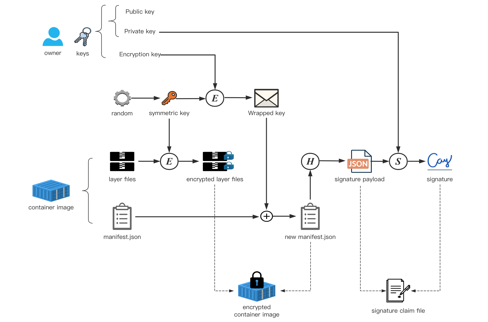

# Image Security Design

## Backgrounds

- [CC Security Solution Explained #1](https://github.com/confidential-containers/documentation/issues/18)
- [Confidential Containers Trust Model](https://github.com/confidential-containers/confidential-containers/blob/main/trust_model.md)
- [Confidential Containers Threat Model](https://github.com/confidential-containers/confidential-containers/blob/main/threats_overview.md)

## Components

- image encryption and signing tools, such as [`skopeo`](https://github.com/containers/skopeo)
- [`image-rs`](..)
- [`ocicrypt-rs`](../../ocicrypt-rs)
- [`attestation-agent`](../../attestation-agent)
- [`confidential-data-hub`](../../confidential-data-hub)
- [Key Broker Service (KBS)](https://github.com/confidential-containers/trustee)

# Production of protected container image

The so-called "protected container image" refers to the container image encrypted and signed by the owner.

**Note**:
- the encryption process must be carried out before the signing process,
in other words, when an image is encrypted and signed,
the signed object is actually the encrypted container image.
- Ideally the image creation, encryption and signing need to happen "atomically" and each steps progresses immediately after the previous step.
(if not so, there is a large window of opportunity for someone to potentially modify the image)

Container image encryption/decryption and signing are currently [under development](https://github.com/opencontainers/image-spec/pull/775).
For encryption/decryption, we will rely on the Rust implementation of [`ocicrypt`](https://github.com/containers/ocicrypt), [`ocicrypt-rs`](../../ocicrypt-rs),
which itself is supposed to be compatible with `ocicrypt`.
For signing, we will rely on the standard [image library](https://github.com/containers/image) or aim to be compatible with it.

An overview of encrypting and signing a container image is as follows:



On the owner side, the key used for encryption and the private key used for signature may be the same key,
depending on what strategy the owner adopts to manage his keys, which is not the focus of this document.

## Image encryption

Image encryption is based on layer granularity: for each layer, a random symmetric key is generated
and used to encrypt the layer; the symmetric key is itself encrypted ("wrapped") with the owner's
key via the [key provider protocol](https://github.com/containers/ocicrypt/blob/main/docs/keyprovider.md),
and the wrapped key material is recorded as an annotation on the layer in the image manifest, with
the `"+encrypted"` suffix added to the layer's `mediaType`.

The owner can use any custom image encryption tool to implement this process
(such as [`skopeo`](https://github.com/containers/skopeo) integrated with [`ocicrypt`](https://github.com/containers/ocicrypt)),
as long as it meets the implementation specs described in
[IMAGE_ENCRYPTION.md](../../attestation-agent/docs/IMAGE_ENCRYPTION.md) (annotation packet format,
layer annotation keys) and [IMPLEMENTATION.md](../../attestation-agent/docs/IMPLEMENTATION.md)
(KeyProvider protocol). For a worked example of the resulting manifest annotations, see
[Inspecting the image](../../attestation-agent/coco_keyprovider/README.md#inspecting-the-image).

## Image signing

There are multiple image signing and verification protocols/solutions in the field.

The signing scheme is specified by `type` field by the owner of the image
security [policy file](ccv1_image_security_design.md#policy) distributed to image-rs.

When verifying the signature, image-rs can select the appropriate scheme for signature verification according to this field.

We start by supporting the [Red Hat simple signing format](https://www.redhat.com/en/blog/container-image-signing).
This is a simple and direct signature system,
which uses the key of OpenPGP([RFC 4880](https://datatracker.ietf.org/doc/html/rfc4880#section-5.4))
and a simple signature [payload format](https://github.com/containers/image/blob/main/docs/containers-signature.5.md).

In the future, confidential containers will gradually support a variety of image signature schemes.
The differences between these schemes are as follows:

1. Signature payload format.

2. Signature algorithm.

3. Signature storage and signature distribution.

We make modular design for the above three during signature verification,
and select the appropriate signature verification method according to the configuration of policy.

## Image distribution

After the encryption and signing are completed, we obtain two products:
the encrypted container image itself and the signature.
the distribution schemes of the two are as follows:

- container image:
  - When using the protected boot image scheme,
the container image can be directly placed in the rootfs of boot image or pushed to a remote registry;
  - When using the unprotected boot image scheme,
the owner must push the container image to the remote registry.

- signature:
  - If image is pushed to a remote registry:
Stored in different places according to the different signature schemes used.
  - If image is placed in the boot image rootfs:
Store it in the specified `sigstore` (a customized local Dir in boot image rootfs).


# Deployment of protected container image

In the confidential container design, security functions will be performed when `image-rs` pulls the container image,
including checking the registry allow list, verifying the container image signature (if needed),
and decrypting the container image layers.
The steps are as follows:

1. Obtain the policy set matching the image from the `policy.json` file.
   - If it is rejected, the pull action will be terminated directly;
   - If it is unconditional acceptance, skip the second and third steps;
   - If it is a signature verification requirement, proceed to the following steps

2. (if signature verification is needed in policy) Get the signature of the container image.

3. (if signature verification is needed in policy) Verify the signature of the container image according to the configuration of the policy.

4. Pull the container image layer by layer. If an encrypted container image layer is encrypted, decrypt it.

After the image is pulled, the subsequent deployment process is consistent with that of the normal container image.

## Policy

The policy file here comes from the signature verification [policy configuration file](https://github.com/containers/image/blob/main/docs/containers-policy.json.5.md)
introduced in the implementation of Red Hat simple signing in the [containers/image](https://github.com/containers/image) project.
This policy file can not only be used for Red Hat simple signing, in the confidential container design,
we will continue to customize and expand the content of the policy file as
a general signature verification configuration file compatible with different signature schemes.

Its main functions are as follows:

- Declare a allow list of container images with "transport-scope" granularity

- Declare the signature scheme used to verify the signature of various images

- (Optional) Specify the public key (path, data, ID, ...) which should to be used when verifying the image signature

At present, the following two types of transport is supported in confidential containers:

- `docker`: used to match the image in the container registry that implements the docker registry HTTP API V2 protocol.

- `dir`: used to match images located in the local file system.

A safe and reasonable `policy.json` file may look like the following example:

```json
{
    "default": [{"type": "reject"}],
    "transports": {
        "docker": {
            "docker.io/my_private_registry": [
                {
                    "type": "signedBy",
                    "keyType": "GPGKeys",
                    "keyData": "<public Key>",
                }
            ],
            "registry.access.redhat.com": [
                {
                    "type": "signedBy",
                    "keyType": "GPGKeys",
                    "keyPath": "/etc/pki/rpm-gpg/RPM-GPG-KEY-redhat-release",
                }
            ],
        },
        "dir": {
            "": [{"type": "insecureAcceptAnything"}]
        }
    }
}
```

Before pulling the container image layers,
match the policy in the following order according to the [container image reference](https://github.com/containers/image/blob/main/docker/reference/reference.go):

- Match single specific scopes under each member in `transport`, for example:
  - For the image from the container registry that implements the Docker Registry HTTP API V2 protocol,
  match each scope under the `docker` member;
  - For the image from local file system, match each scope under the `dir` member;
- Match the default scope under the member in the transport. for example, the `""` scope of the transport `dir`.
- Match the global default scope, such as the `default` field in the first line of the above example.

After the matching is successful, the policy set under the corresponding scope is executed, as described in
[Policy Requirements](https://github.com/containers/image/blob/main/docs/containers-policy.json.5.md#policy-requirements),

In order to flexibly support different signature schemes, we will check the field `type` to see whether it is a
signing scheme, as what [Policy Requirements](https://github.com/containers/image/blob/main/docs/containers-policy.json.5.md#policy-requirements)
does.

Currently, the values of `type` showing signature verification should be involved is:

- `signedBy`: Red Hat simple signing scheme.

In the future, more signature schemes will be supported, and this field will have more allowed values.

For the example of the policy file given above, the meaning of it is as follows:

1. For images from the local file system, they are allowed to pull and run no matter there is a valid signature or not.

2. For images from the `docker.io/my_private_registry` registry,
there must exist at least one signature under simple signing scheme that can be verified by the keys in `keyData`.

3. For images from the `registry.access.redhat.com`,
there must exist at least one signature under simple signing scheme that can be verified by the keys in `/etc/pki/rpm-gpg/RPM-GPG-KEY-redhat-release`.

4. Reject all other images.

The above example provides a secure and robust policy configuration,
but the policy file still provides sufficient configuration flexibility for weak security requirements.
For example, if the owner needs to completely disable the container image signature verification function
(for example, the owner thinks that encryption alone is enough to meet his security requirements),
policy file can be:

```json
{
  "default": [
    {
      "type": "insecureAcceptAnything"
    }
  ],
}
```

**Warning**: this configuration will make the pod accept all unsigned container images.

If the owner want to unconditionally accept an image from a specific registry,
he just need to change the policy of the member matching the registry under the corresponding scope to `insecureAcceptAnything`.

## Signatures verification

### Get signatures

Different signature schemes generally use different signature storage locations.
When image-rs need to verify the signature, it first need to obtain the signature of the image.
The storage location may be:

1. Local file system.

2. Container registry.

3. Customized remote server. Such as a http/https web server.

4. Image metadata.

### Verification steps

A single signature's verification action is divided into the following steps:

1. Get and parse the signature blob.

2. Read the `policy.json`'s policy, select the scheme to use when verifying the signature according to the `type` field.

3. Get public key.

3. Use the public key to verify the cryptographic signature.

4. Compare whether the infomation in the signature payload is consistend with the actual infomation of the image.

## Image layer decryption

After verifying the container image signature, `image-rs` calls `ocicrypt-rs` to decrypt each
encrypted image layer. `ocicrypt-rs` sends the layer's annotation packet to `confidential-data-hub`'s
KeyProvider service, which decrypts it (using whichever KBC plugin is configured — attesting via
`attestation-agent` and communicating with the KBS if using `cc_kbc`, or reading a local resources
file if using `offline_fs_kbc`) and returns the layer's symmetric key. See the "Attestation Agent and
Confidential Data Hub" section below, and
[IMPLEMENTATION.md](../../attestation-agent/docs/IMPLEMENTATION.md), for the full decryption flow.

# Attestation Agent and Confidential Data Hub

The [`attestation-agent`](../../attestation-agent) (AA) and [`confidential-data-hub`](../../confidential-data-hub) (CDH)
are indispensable core components in the confidential containers architecture, together undertaking
the trust distribution function of the confidential container:

- **`attestation-agent`** performs the TEE attestation handshake (RCAR protocol) with the relying
  party (KBS) to obtain a signed attestation token. It does not itself serve
  `GetResource` or `KeyProvider` requests to `image-rs`/`ocicrypt-rs`. AA is only involved when CDH
  is configured with its `cc_kbc` KBC plugin (see below); other KBC plugins, such as
  `offline_fs_kbc`, don't use AA or perform any attestation at all.
- **`confidential-data-hub`** is the component that `image-rs` and `ocicrypt-rs` actually talk to.
  When using the `cc_kbc` KBC plugin, it fetches the attestation token from AA (over ttrpc/gRPC) and
  uses it as a bearer token to call the KBS's REST API directly — CDH does not need to know how the
  token was obtained. It serves as the source of the owner's confidential information for both
  signature verification (`GetResource` service, used to fetch `policy.json` and related materials)
  and image decryption (`KeyProvider` service, used to unwrap the per-layer symmetric key). CDH
  advertises its `KeyProvider` service under the legacy ocicrypt provider name `attestation-agent`
  for backward-compatible annotation handling.

See [IMPLEMENTATION.md](../../attestation-agent/docs/IMPLEMENTATION.md) and
[Resources Services](../../confidential-data-hub/docs/RESOURCES_SERVICES.md) for the full protocol
and implementation details, and the `.proto` definitions in
[`protos/protos/confidential-data-hub`](../../protos/protos/confidential-data-hub).
